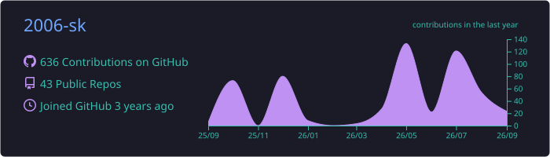
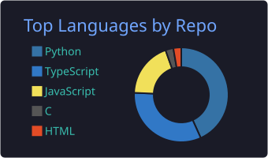
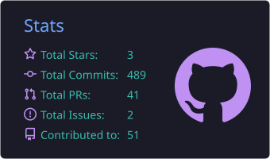

# Hi, I'm Shresth 👋

### Backend Engineering · Applied AI · Automation · Security

Computer Science student at **San José State University**, building practical systems that turn complex workflows into reliable products.

  
  
  

## About me

- Building backend APIs, AI agents, automation systems, and security tooling
- Currently developing **[Koyal Browser](https://github.com/2006-sk/Koyal-browser)**, an autonomous browser-QA system that maps, tests, and self-heals long-running web workflows
- Interested in reliable agentic systems, infrastructure, applied LLMs, and ethical security
- Always learning, testing, and shipping

## Tech stack

  
  
  
  
  

  
  
  
  
  
  
  

## GitHub activity

---

  Build useful things. Test them carefully. Keep improving.

